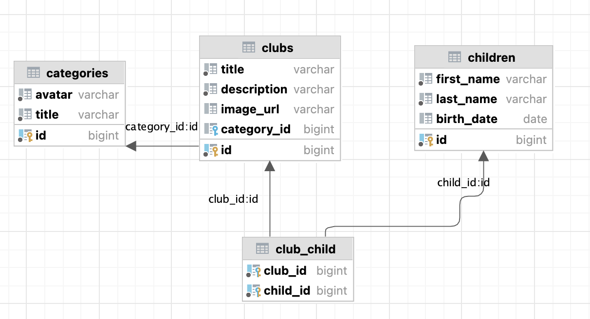

**Let's have database with tables** 

**For testing DB structure we have tests**:
- for checking presence of  `categories` table there is existTable();
- for checking presence of column `avatar` in table  `categories` there is existColumn();
- for checking that column `avatar` in table `categories` has type varchar there is columnType();
- for checking that primary key for table `categories` has name `id` there is checkPK();
- for checking presence of foreign keys for table `club_child` with references to tables `club` and `child` there is checkFKs();
- for checking not null constraint for column `title` in table `categories` there is checkNotNull();
- for checking uniqueness of `title` in table `club` there is checkUnique().
 
**Refactor these tests using parameterized tests for verifying structure of all tables**:
- for existTable() use @ValueSource;
- for checkPK() use  @CsvSource;
- for checkFKs() use @MethodSource;
- for columnType() use @CsvSource
- for checkUnique() use @CsvSource
 
